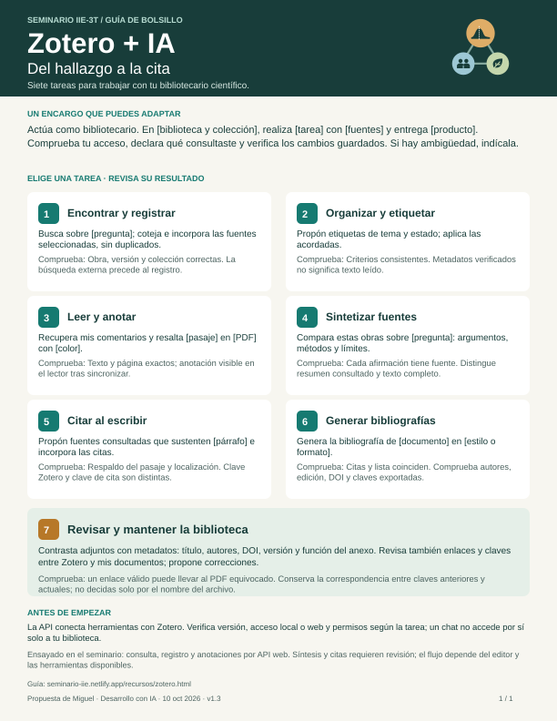

Una referencia debe poder recuperarse y revisarse. Usaremos **Zotero para registrar la bibliografía** y aprenderemos a consultarla con ayuda de una **API**: una interfaz por la que un programa solicita información a otro. El asistente puede ayudarte a recuperar datos; tú revisas qué fuente respalda cada afirmación.

Esta es la segunda parte de [Preparar tu proyecto](../preparar-proyecto.qmd). Reserva **15–20 minutos adicionales** si ya tienes Zotero; la instalación o la resolución de problemas puede requerir acompañamiento. Puedes conservar la base agéntica que elegiste.

## 1. Organiza una primera referencia

Instala o abre [Zotero de escritorio](https://www.zotero.org/download/). Crea una colección con el nombre de tu proyecto, o identifica una existente. Una colección reúne referencias de una biblioteca; no equivale a una carpeta de archivos de tu proyecto.

Elige una fuente que ya estés usando en tu pregunta. Busca primero si existe en tu biblioteca; si no, agrégala desde su DOI, su página editorial o mediante captura manual. Revisa **título, autores, año y DOI o URL** contra la fuente. No necesitas reunir todavía toda la bibliografía ni adjuntar el PDF.

En la definición de tu proyecto anota el nombre de la colección y si revisaste solo los metadatos, el resumen o el texto completo. Agrega una frase: «Esta fuente me sirve para…». Si aún no elegiste una fuente, déjala como pendiente; no pidas al asistente que invente una referencia.

## 2. Prepara la conexión local

En Zotero, abre **Ajustes → Avanzado** y habilita la comunicación con otras aplicaciones del equipo. Mantén Zotero abierto. La API local atiende en `http://localhost:23119/api/`; sus lecturas no requieren clave. Evita exponer ese puerto fuera del equipo. [Documentación oficial](https://www.zotero.org/support/dev/web_api/v3/local_api).

Esa dirección es para consultas desde programas o herramientas del asistente, **no para abrirla como una página web**. Zotero puede cerrar las solicitudes de un navegador y mostrar `ERR_EMPTY_RESPONSE`, aunque la API funcione correctamente. Comprueba la conexión con el encargo del paso 3; para ver tus referencias, usa Zotero de escritorio o tu biblioteca en zotero.org.

Tu asistente necesita una herramienta capaz de hacer solicitudes locales **desde el mismo equipo**. Un chat en la nube no obtiene ese acceso por adjuntar documentos. Si tu entorno no lo permite, realiza ahora la revisión en Zotero y deja la prueba de API para el acompañamiento. No necesitas configurar la API web ni compartir credenciales para esta actividad.

## 3. Consulta y compara

Copia y adapta este encargo:

```text
Quiero comprobar el acceso de lectura a Zotero para mi proyecto.
Primero verifica la conexión local e informa la versión que responde.
Mi biblioteca es [personal o nombre e ID del grupo].
Mi colección se llama [nombre]. Identifícala sin elegir automáticamente
si hay varias coincidencias. Busca dentro de ella [título o DOI].
Devuelve título, autores, fecha, DOI o URL y clave Zotero del ítem.
No crees ni modifiques registros ni recuperes adjuntos o texto completo.
Si no tienes acceso local, explica qué falta; no simules la consulta.
Ayúdame a comparar el resultado con la ficha que veo en Zotero y registra
la prueba, su resultado y el siguiente paso en mis documentos.
```

Comprueba que se trata de **la misma obra y versión**. Si la búsqueda no devuelve nada, revisa colección y términos; el resultado no demuestra que la obra no exista.

::: {.callout-note collapse="true"}
## Para explorar qué hace la API

Una solicitud `GET` pide información. Por ejemplo, `/api/users/0/collections` lista colecciones de la biblioteca personal local. En la copia del proyecto, `scripts/zotero_bibliografia.py` permite comprobar conexión, buscar en una colección y exportar ítems seleccionados a BibTeX. Las instrucciones están en `bibliografia/README.md`; la coordinación puede facilitar esta práctica cuando ya uses Python.

La clave Zotero identifica un registro dentro de una biblioteca. La clave BibTeX identifica una cita en el archivo exportado: **no son intercambiables**. Al exportar, comprueba qué clave usarás en tu documento.
:::

## Qué queda listo

- Una colección identificada y una referencia con metadatos cotejados, o la dificultad concreta pendiente.
- Una breve explicación de para qué usarás esa fuente y qué parte consultaste.
- Una comparación entre la ficha y la respuesta real de la API, o el registro de por qué no pudo ejecutarse.

**Pregunta de comprobación:** si el asistente recuperó autores y título, ¿ya puede afirmar que leyó el artículo? **Respuesta esperada:** no; consultó metadatos. Cualquier interpretación del contenido debe apoyarse en el texto efectivamente leído.

Después aprenderemos a exportar referencias seleccionadas y citar con ellas. El catálogo del equipo se llevará en una biblioteca de grupo compartida. La coordinación facilitará el acceso cuando esté configurada; mientras tanto puedes practicar en tu colección personal. Las copias de una referencia en bibliotecas distintas no se actualizan como un único registro: revisaremos los metadatos en la biblioteca que use cada trabajo. Véase la [guía de grupos de Zotero](https://www.zotero.org/support/groups). Las dificultades de conexión no impiden participar en la apertura.

## Ficha de consulta: Zotero + IA {#ficha-de-consulta}

¿Qué puedes pedirle al **bibliotecario científico** y cómo reconocer que la tarea quedó bien? Esta ficha de una página reúne siete casos de uso. Úsala cuando quieras ampliar la primera consulta de esta guía: elige una tarea, completa los campos del encargo y revisa la comprobación sugerida. No necesitas realizar todos los casos para participar en el seminario.

[Descargar la ficha en PDF (A4, una página)](zotero-ia-ficha.pdf){.btn .btn-primary} · [Abrir la imagen SVG ampliable](zotero-ia-ficha.svg)

{width=100%}

::: {.callout-note collapse="true"}
## Los siete casos, en texto

1. **Encontrar y registrar:** buscar fuentes y comprobar obra, versión y colección antes de incorporarlas.
2. **Organizar y etiquetar:** aplicar criterios acordados; verificar metadatos no equivale a leer el texto.
3. **Leer y anotar:** recuperar comentarios y marcar pasajes; comprobar texto, página y resultado en el lector.
4. **Sintetizar fuentes:** comparar argumentos, métodos y límites, indicando qué partes se consultaron.
5. **Citar al escribir:** vincular afirmaciones con fuentes y localizaciones que realmente las respalden.
6. **Generar bibliografías:** cotejar la lista con las citas del documento y el formato solicitado.
7. **Revisar y mantener la biblioteca:** contrastar adjuntos con metadatos y comprobar enlaces, versiones y claves de cita.

**Encargo adaptable:** «Actúa como bibliotecario. En [biblioteca y colección], realiza [tarea] con [fuentes] y entrega [producto]. Comprueba tu acceso, declara qué consultaste y verifica los cambios guardados. Si hay ambigüedad, indícala».
:::

La ficha orienta el trabajo; la ejecución depende del acceso, los permisos y las herramientas disponibles. En el seminario se ensayaron consultas, incorporación de referencias y anotaciones mediante la API web. No se presenta cada caso como un flujo automático ya validado. Contrasta las interpretaciones con las fuentes y verifica los cambios en Zotero o en tu documento.

**Fuentes de apoyo:** [API local](https://www.zotero.org/support/dev/web_api/v3/local_api), [API web](https://www.zotero.org/support/dev/web_api/v3/basics), [lector PDF y notas](https://www.zotero.org/support/pdf_reader) e [integración con editores](https://www.zotero.org/support/word_processor_integration). La ficha es material del seminario, no documentación oficial de Zotero.

*Propuesta de Miguel, desarrollada con asistencia de IA. Versión de trabajo: 10 de octubre de 2026; incluye la ficha de consulta v1.2, imagen ampliable y PDF imprimible. Pendiente de prueba con participantes.*
